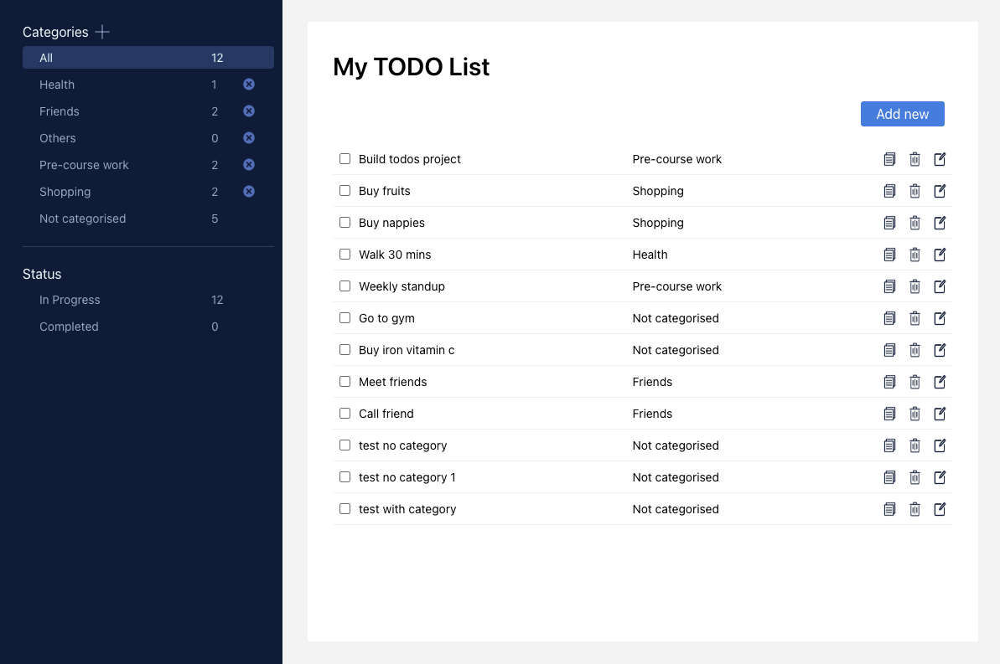
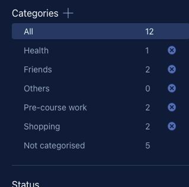
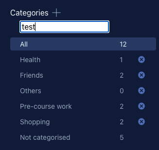
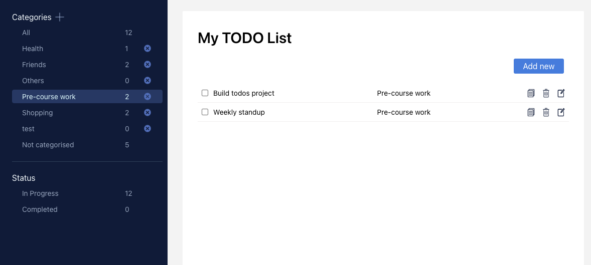
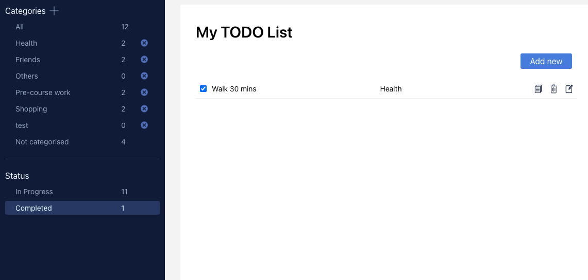
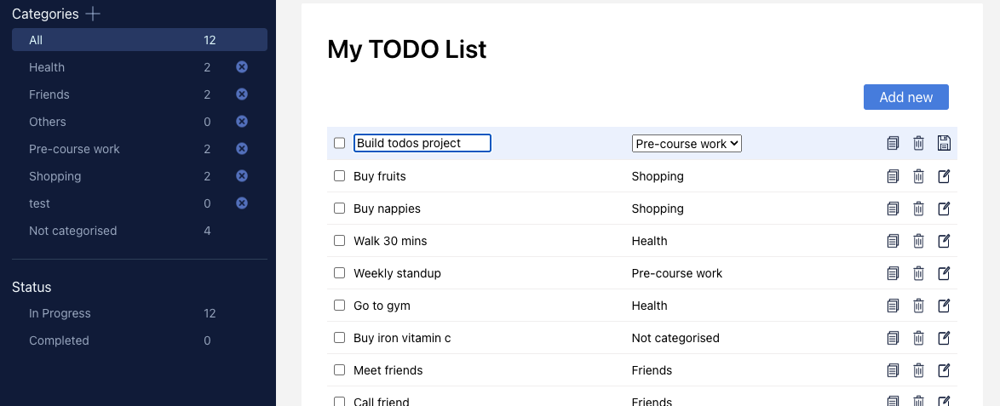
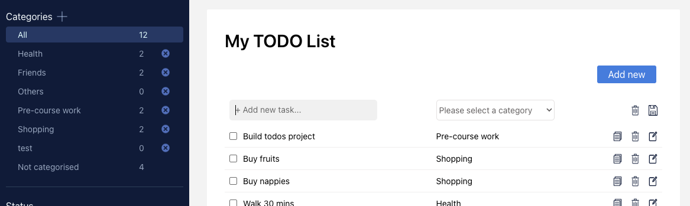

# Todos

This is an application that allows people to track, add, and delete tasks as well as manage categories of tasks.

### 🚀 [Launch Live Todos App](https://todos-app-siyu.netlify.app/)

## Table of Contents

- [Snippets](#snippets)
- [Tech Stack](#tech-stack)
- [Requirements](#requirements)
    - [MVP](#mvp)
    - [Bonus](#bonus)
- [Features](#features)
- [Future Goals](#future-goals)

## Snippets
 

## Tech Stack

- React
- Typescript
- SCSS
- Fetch
- Java
- Spring
- MySql

## Requirements
### MVP
-   Must be able to add categories
-   Must be able to add new tasks tagged with a task category
-   Must be able to update tasks automatically by changing the task name and the category
-   Must be able to duplicate tasks
-   Must be able to delete tasks
-   You must add your own styling
-   Deleting a task should set an `isArchived` flag in the database instead of deleting the task from the database
-   Add a filter to the frontend application that allows you to filter tasks by category
-   Categories and Todos should be stored in separate tables

### Bonus

-   Come up with a feature that allows us to delete and update task categories
-   Create a summary section that lists how many of each type of task there are

## Features

- This todos application has two sections: a side bar, which contains all the categories and the status of completed or in progress with the number of todos under each category and status, and the todo list part which shows all the todos or the todos under a particular category or status: 

- For the categories section, the user can click the "+" to add category, or click "x" to delete a category. Once a category is deleted, all the todos which previously belong to this category will fall into the "Not categorised" category.   

- When adding a new category, after click the "+", there will be a input box showing on the top, the user can simply press enter or click anywhere on the screen to add a new category, then the new category will be shown in the categories section with a number of todos 0. Also the user can quit the adding anytime by press the Esc key, the input box will disappear after pressing the Esc key.   

- By default, the "All" category will be selected and all the todos will be shown in the todo list sections. The user can click any category to see the particular todos under this category

- The "Status" section is showing the todos which are in progress and completed, so when select the checkbox of a todo to make it checked, it will be automatically shown under the "Completed" list

- In the todo list section, each todo has its complete checkbox, content, category and edit icons in the line. By clicking the checkbox, a todo will be made completed. The three icons on the right are copy, delete and edit. By clicking the edit icon, the line will be turn into editable mode, the content and the category will become input box and select box, which users can make edit to it, and the edit icon itself will also change to a save icon so that the user can save the updates after editing. 

- When clicking the "Add new" button, a new line will be shown on the top of the list with an empty input box for the content and a select box for the category, the user can click the save icon to save the new todo, or click the delete icon to delete it.

## Known Issues 
 The speed of the deployed app is a bit slow due to location of the server (in US) and the free version of database

## Future Goals
- Add validation on creating new category to prevent adding duplicate categories
- Add test
- Maybe will try to deploy it on AWS to optimise the speed

